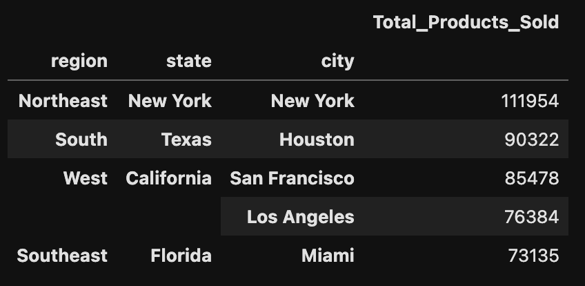
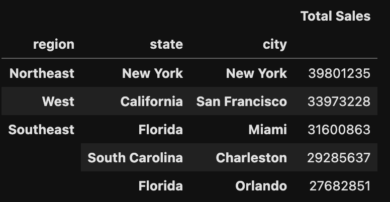
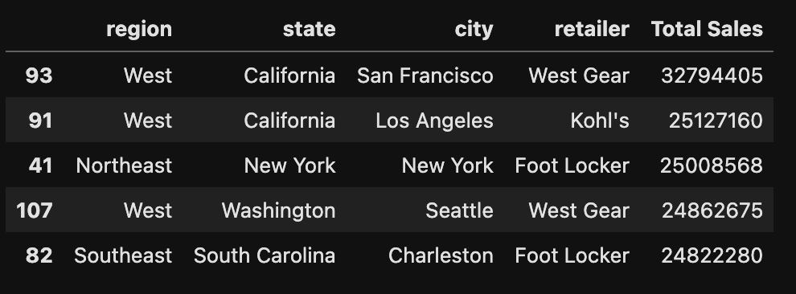
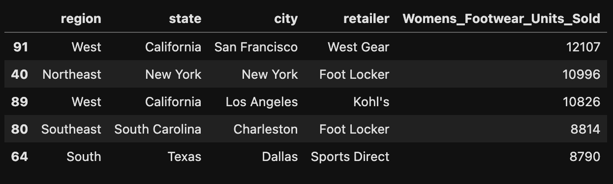
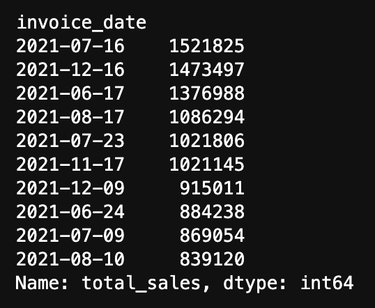
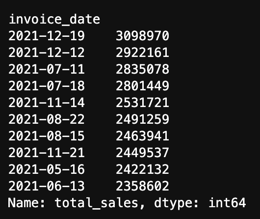

# athletic_sales_analysis
Week 5 Challenge

# Functionality:
This dataframe ingests and combines two csv files containing a total of 9,643 invoices. It futher identifies the region/state/city with the most products sold, the region/state/city with the most sales, the retailer with the most sales, the retailer that sold the most women's athletic footwear, the day with the most women's athletic footwear sales, and the week with the most women's athletic footwear sales.

### Total Products Sold

---
### Total Sales

---
### Retailer Total Sales

---
### Women's Athletic Footwear Products

---
### Day with Most Sales

---
### Week with Most Sales

---

# Approach:
1. The first step, *explore*, was to review the raw csv data, ingest the two files, and investigate the data within the two dataframes to identify unique regions, states, cities, retailers, and products. 
2. During the second step, *transform*, the dataframes were combined, cleaned, and column types changed as required. Furthermore, the combined dataframe was manipulated in order to provide sales insight into the top regions and retailers. 
3. The third part of the approach, *confirm*, was to validate calculations against the provided summary screenshots from the challenge module in Canvas. 
4. The last step in the approach was to *summarize and analyze*.

# Summary of Findings:
The data showed that the region/state/city with the most products sold was the Northeast/New York/New York combination with 111,954 products. The region/state/city with the most sales was also the Northeast/New York/New York combination with $39,801,235. The retailer with the most sales was West Gear in San Francisco with $32,794,405. The retailer with the most women's athletic footwear products sold was West Gear in San Francisco with 12,107 products. The day with the most women's athletic footwear sales was July 16, 2021, with $1,521,825. The week with the most women's athletic footwear sales was December 19, 2021 with $3,098,970.

# Plagerism Statement:
No specific code was copied but the sources below were referenced for examples and syntax. 

# Sources:

Harrison, M. (2021). Effective Pandas: Patterns for Data Manipulation. Matt Harrison.

Lutz, M. (2013). Learning python: Powerful object-oriented programming. " O'Reilly Media, Inc.".

 Pandas groupby and apply aggregate function across rows. (n.d.). Stack Overflow. Retrieved April 4, 2024, from https://stackoverflow.com/questions/71209619/pandas-groupby-and-apply-aggregate-function-across-row 
